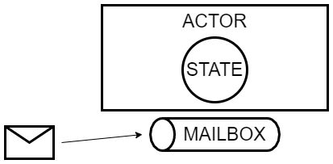

# Actor Model

## What?

The Actor Model is a conceptual model of concurrent computation. An actor represents a fundamental unit of computation. It can perform the following operations:

- Create another actor
- Send a message
- Define how to handle the next message

## How?

### Private State

An actor has it's own private state.
It decides how to handle the next message based on the current state.
The only way to modify or access the state is through messages.

### Lightweight

The actors are lightweight because they are not mapped to a single thread and it's possible to create a large number of them.
Actors always run Asynchronously.

### Mailbox properties

Every actor has its owm mailbox.
It processes the messages in the mailbox one a the time in a FIFO order.
If the actor crashes, its messages are not lost and it can pick up where it left off.

### Messages properties

The messages are simple, immutable data structures, easy to send over the network.

## Why?

### Fault tolerance

### Actors reduce big problems into smaller ones

### Cons

#### Actors can deadlock

Actor A could wait for a message from Actor B and vice-versa.

#### Actors mailboxes can overflow

If an actor processes messages slower than it receives them, the mailbox can overflow since its implementation is usually a linked list.

## Implementations

### Akka

[Akka](https://akka.io/); [Akka.NET](https://getakka.net/index.html)

Akka.NET NuGet packages:

- [Akka](https://www.nuget.org/packages/Akka/)
- [Akka.Remote](https://www.nuget.org/packages/Akka.Remote/)
- [Akka.Persistence](https://www.nuget.org/packages/Akka.Persistence/)

### [Elixir](https://elixir-lang.org/)

## Resources

- https://www.youtube.com/watch?v=ELwEdb_pD0k
- https://www.youtube.com/watch?v=7erJ1DV_Tlo
- https://www.youtube.com/watch?v=0KnIMDoJpZs
- https://havret.io/akka-net-asp-net-core
- https://bartoszsypytkowski.com/dont-ask-tell-2/
- https://doc.akka.io/docs/akka/current/typed/guide/introduction.html
